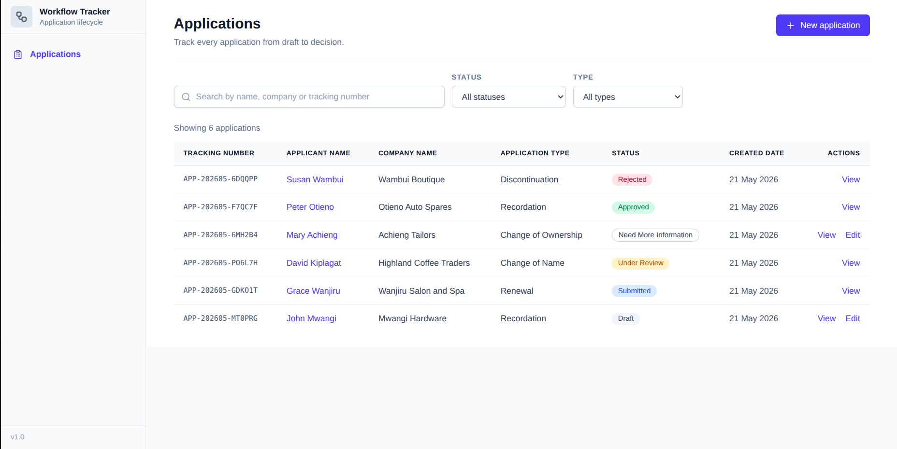
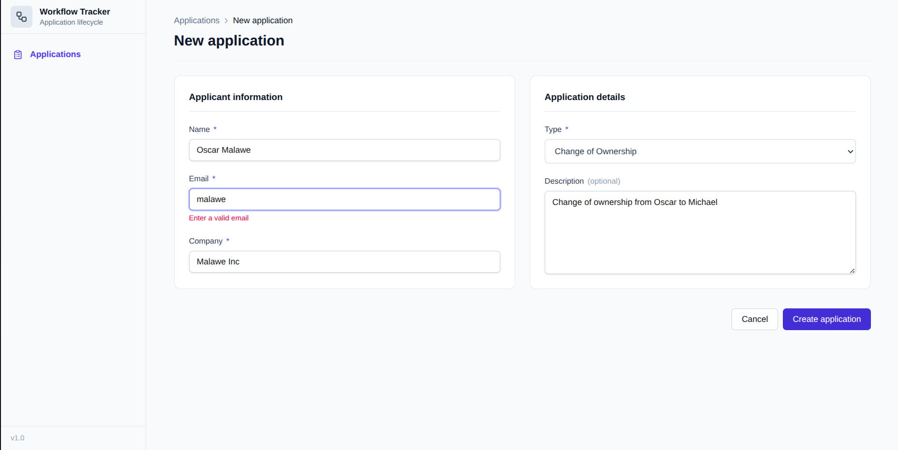
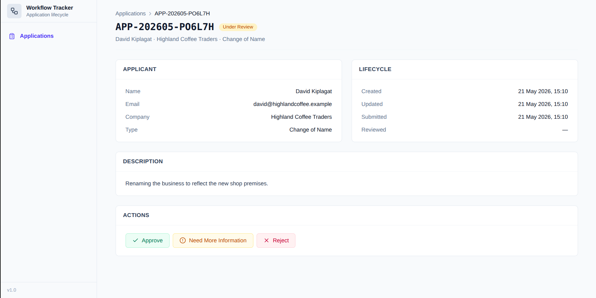
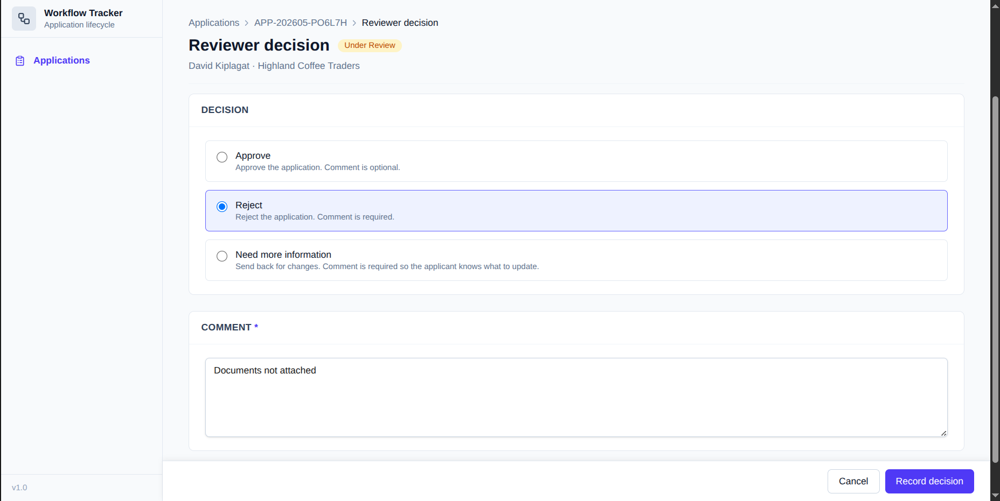

# Workflow Tracker

A small workflow tracker for applications.

**Author**: Nicky Chepteck Chemos · nickyhemos@gmail.com

**Walkthrough video**: https://www.loom.com/share/6040e180c09b4c08a6d9eb2fc2658fba

## Quick start

```bash
git clone https://github.com/Nickychemos/Workflow-Tracker.git
cd Workflow-Tracker
make run         # backend on http://localhost:8001
make fe-dev      # frontend on http://localhost:5173 (in another terminal)
```

Open http://localhost:5173. The list shows six seeded applications, one in each status.

Both commands handle setup on first run. `make run` creates the Python venv, installs backend deps, brings up Postgres in docker, applies migrations, and starts the dev server. `make fe-dev` installs npm deps and starts Vite. No extra steps needed.

## Screenshots

### Application list



Six seeded applications, one in each status. Search, status, and type filters at the top.

### Validation on the create form



Client side Zod validation catches a bad email before any request goes out.

### Application detail, Under Review



An Under Review application. The Actions card shows all three reviewer options.

### Reviewer decision



Reviewer rejecting an application. The comment is required, the sticky footer holds Cancel and Record decision.

## Stack

| Area | Tools |
|---|---|
| Backend | Python 3, Django 5, Django Ninja, Pydantic, psycopg, pytest |
| Frontend | React 19, TypeScript, Vite, Tailwind 4, TanStack Query, React Hook Form, Zod, Axios |
| Database | PostgreSQL 16 via docker compose |
| Infra | Docker, docker compose, Makefile, GitHub Actions |

## Repository layout

```
.
├── Makefile
├── docker-compose.yml
├── backend/
│   ├── core/                Django project
│   └── applications/
│       ├── enums.py         ApplicationStatus, ApplicationType
│       ├── models.py        the Application model
│       ├── tracking.py      APP-YYYYMM-XXXXXX generator
│       ├── services.py      workflow rules
│       ├── schemas.py       Pydantic in and out
│       ├── api.py           the 7 Ninja endpoints
│       └── tests/           29 pytest cases
└── frontend/
    └── src/
        ├── routes/          list, create, detail, edit, review
        ├── components/      layout, shadcn style primitives
        ├── lib/             api client, types
        └── schemas/         Zod schemas
```

## Running the backend

The backend lives in `backend/`. Postgres runs in docker, Django on the host.

```bash
make run         # one shot: venv, pip install, db, migrate, runserver on :8001
make migrate     # apply migrations
make test        # run pytest (29 cases)
make shell       # Django shell
make superuser   # create an admin user
make help        # full target list
```

First run takes about a minute for the pip install. Subsequent runs skip the steps that are already done.

API docs at http://localhost:8001/api/docs once the server is up.

Backend env vars live in `backend/.env.example`. The Makefile copies it to `backend/.env` the first time you run `make run`, so first time setup needs nothing by hand.

If you want everything in docker including the backend:

```bash
make up          # docker compose up -d (db + backend)
make down        # stop containers
make logs        # tail backend logs
```

### Migrations

`make run` applies migrations automatically on every start. To run them by hand:

```bash
make migrate            # apply pending migrations
make makemigrations     # after changing models
```

## Running the frontend

```bash
make fe-dev      # one shot: npm install if needed, then Vite on :5173
make fe-build    # production build
```

First run installs the npm dependencies. Subsequent runs skip that step.

The frontend reads `VITE_API_URL` from `frontend/.env`. Default is http://127.0.0.1:8001/api.

## API reference

| Method | Path | Purpose |
|---|---|---|
| POST | /api/applications/ | Create a draft |
| GET | /api/applications/ | List applications (filter by status, application_type, search) |
| GET | /api/applications/{id}/ | Application detail |
| PATCH | /api/applications/{id}/ | Edit a Draft or Need More Info |
| POST | /api/applications/{id}/submit/ | Submit a Draft or Need More Info |
| POST | /api/applications/{id}/start-review/ | Move Submitted to Under Review |
| POST | /api/applications/{id}/decision/ | Record APPROVED, REJECTED, or NEED_MORE_INFO |

Status codes:

- 201 on create
- 200 on read or successful transition
- 409 when a workflow rule blocks the transition
- 422 when the request body fails validation
- 404 when the application does not exist

## Workflow rules

The brain of the app lives in `backend/applications/services.py`. Endpoints are one liners that delegate to the service layer.

| Rule | Where it lives |
|---|---|
| Only Draft or Need More Info can be edited | update_draft |
| Only Draft or Need More Info can be submitted | submit |
| Only Submitted can move to Under Review | start_review |
| Only Under Review can receive a decision | record_decision |
| Approved and Rejected are terminal | enforced by absence from the editable set |
| Need More Info can be edited and resubmitted | both lists include NEED_MORE_INFO |
| Reject and Need More Info require a comment | record_decision |

29 pytest cases cover every rule.

## Assumptions

1. No authentication or roles. Anyone with the URL can act in any role. RBAC is in the improvements list.
2. Need More Information applications can be edited and resubmitted. The spec says "Only Draft applications can be submitted" but later says Need More Info can be edited and resubmitted. I treat Need More Information applications as both editable and submittable.
3. Tracking numbers are server generated as `APP-YYYYMM-XXXXXX` (six base 36 characters). The client never supplies one.
4. PostgreSQL via docker compose, no SQLite fallback. One DB everywhere keeps setup predictable.
5. No frontend unit tests. The scoring weight is on backend rules and the Zod form schemas, both of which are covered.

## What I would improve with more time

- **RBAC** with applicant and reviewer roles. Right now anyone with the URL can act in any role.
- **Sign up and sign in pages** backed by JWT or session auth.
- **Document upload** in the application form for supporting files like proof of ID and payment receipts.
- **User profile page** where applicants and reviewers can manage their info.
- **Audit log**. A StatusTransition table recording every transition with from, to, actor, comment, and timestamp. The current model loses history once status changes.
- **Notifications**. Email the applicant on every status change. Celery and Redis would slot in cleanly.
- **End to end tests** with Playwright covering the full lifecycle in a browser.
- **Deployment scripts** for Fly.io or Render with a brief runbook.

## License

MIT. See [LICENSE](LICENSE).
